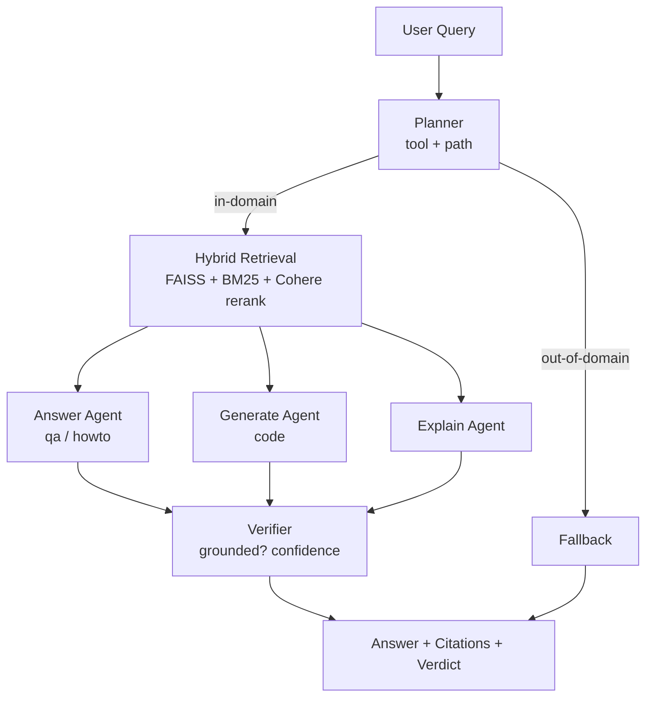

# agentic-rag

> An **agentic Retrieval-Augmented Generation** system over the LangChain / LangGraph / LangSmith documentation. A LangGraph state machine plans each query, runs hybrid retrieval with reranking, routes to a specialized agent, and verifies the answer against its sources before returning it.

Unlike a "retrieve → stuff context → generate" RAG pipeline, this project models RAG as a **graph of cooperating agents**: a planner decides *what kind* of question it is, retrieval is hybrid (dense + sparse) with a cross-encoder rerank, and a final verifier acts as a hallucination guard.

## Architecture



| Stage | Role |
|-------|------|
| **Planner** | LLM router with structured output — picks the tool (`answer` / `generate` / `explain` / `none`) and a `fast`/`slow` execution path. Sends out-of-domain queries straight to fallback. |
| **Retriever** | LLM query optimization → **hybrid search** (FAISS dense vectors + BM25) → **Cohere `rerank-english-v3.0`** cross-encoder rerank. Embeddings: `BAAI/bge-m3`. |
| **Answer / Generate / Explain agents** | Specialized prompts: factual QA & step-by-step how-tos, code generation, and conceptual explanations — each answers strictly from retrieved context. |
| **Verifier** | A strict grounding check that classifies the output as `ok` / `hallucination` and returns a confidence score. |
| **Fallback** | Politely declines questions outside the LangChain ecosystem. |

The whole flow is a [LangGraph](https://github.com/langchain-ai/langgraph) `StateGraph`, and every run is traced in **LangSmith**.

## Tech stack

- **Orchestration:** LangGraph (`StateGraph`, conditional routing), LangChain
- **LLM:** Google Gemini (`gemini-1.5-flash`) with structured output (Pydantic / TypedDict)
- **Retrieval:** FAISS (dense) + `rank-bm25` (sparse) hybrid, `sentence-transformers` (`BAAI/bge-m3`)
- **Reranking:** Cohere `rerank-english-v3.0`
- **Observability:** LangSmith tracing
- **Corpus:** custom scraper for the LangChain docs (`scraper/`)

## Project layout

```
main_node.py          # LangGraph graph: nodes, routing, compile & run
tools/
  planner.py          # query router (structured output)
  retriever.py        # hybrid search + Cohere rerank + query optimization
  answer_agent.py     # qa / howto answers
  generate_agent.py   # code generation
  explain_agent.py    # conceptual explanations
  verifier_agent.py   # hallucination / grounding check
scraper/              # build the docs corpus (scrape → parse → merge)
data/                 # prebuilt FAISS index + docstore
```

## Getting started

### Prerequisites
- Python 3.10+
- API keys: **Google (Gemini)**, **Cohere**, and optionally **LangSmith** for tracing

### Setup

```bash
git clone https://github.com/cagatayozbek/agentic-rag.git
cd agentic-rag
python -m venv .venv && source .venv/bin/activate
pip install -r requirements.txt
```

Create a `.env` file:

```env
GOOGLE_API_KEY=your_google_api_key
COHERE_API_KEY=your_cohere_api_key
# Optional — enables LangSmith tracing
LANGSMITH_API_KEY=your_langsmith_api_key
LANGSMITH_PROJECT=agentic-rag
LANGSMITH_TRACING=true
```

### Run

```bash
python main_node.py
```

```python
from main_node import app

out = app.invoke({"query": "How do I build an agent with LangChain?"})
print(out["answer"])      # or out["code"] for generation queries
print(out["citations"])   # source chunks
print(out["verdict"])     # "ok" | "hallucination"
print(out["confidence"])  # grounding confidence
```

> The repo ships with a prebuilt index under `data/`. To rebuild the corpus from scratch, run the scripts in `scraper/` (`scraper.py` → `parsing.py` → `merge_json.py`) and re-embed.

## Why it's interesting

- **Agentic routing** instead of one-size-fits-all generation — questions are classified and dispatched to the right specialist.
- **Hybrid retrieval + cross-encoder rerank** for stronger recall *and* precision than dense-only RAG.
- **Built-in hallucination guard** — the verifier makes groundedness an explicit, inspectable step.
- **Fully traced** in LangSmith, so every decision in the graph is observable.

## License

[MIT](./LICENSE)
